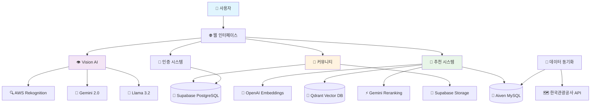
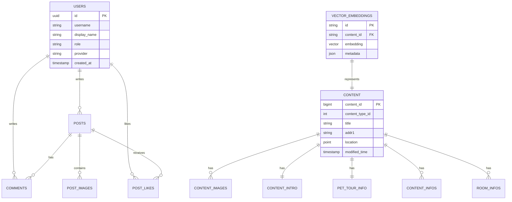
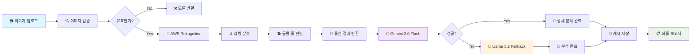
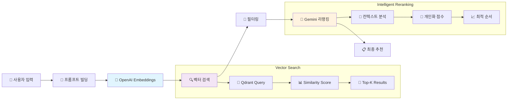

# 🐾 PETTY - 반려동물과 떠나는 완벽한 여행

<div align="center">
  


[](https://spring.io/projects/spring-boot)
[](https://openjdk.org/)
[](https://postgresql.org/)
[](https://mysql.com/)
[](https://qdrant.tech/)
[](https://www.oracle.com/cloud/)
[](https://aws.amazon.com/)
[](https://supabase.com/)

</div>

## 🎯 서비스 소개

😽 PETTY는 반려동물과 함께하는 여행을 위한 AI 기반 추천 서비스입니다  
🐶 사용자의 반려동물 사진을 분석하여 맞춤형 여행지를 추천받을 수 있어요!  
🗺️ 현재 위치 기반 주변에 있는 반려동물 여행지 리스트를 확인할 수 있어요!  
🖊️ 커뮤니티 기능을 통해 반려동물 여행 경험을 공유할 수 있어요!


<br>

## ✨ 주요 기능

###  🎯 JWT 기반 로그인
> 이메일 인증과 소셜 로그인을 통한 사용자 인증 시스템

- **로컬 로그인**: 이메일 인증 기반 SMTP 회원가입
- **소셜 로그인**: GitHub, Kakao OAuth2 연동
- **JWT**: Access Token (1시간) + Refresh Token (7일)
- **Cookie 보안**: HttpOnly, Secure 설정
- **토큰 순환**: 사용자별 최대 3개 Refresh Token 관리 

### 🤖 AI 반려동물 분석

> 반려동물 사진을 입력하면, 성격, 외모, 특성에 대한 정보 분석

- **다중 AI 모델**: AWS Rekognition + Gemini 2.0 Flash + Llama 3.2 Vision
- **특성 분석**: 종, 품종, 크기, 무게, 맹견 여부 자동 판별
- **폴백 시스템**: 모델 간 우선순위를 통한 안정성 보장

### 🔍 벡터 기반 여행지 추천

> 사용자가 원하는 조건의 여행지를 입력하면 AI를 통해 맞춤 추천 제공

- **유사도 검색**: OpenAI Embeddings + Qdrant Vector DB
- **AI 활용 리랭킹**: Gemini를 활용한 맞춤형 순위 조정
- **다중 필터링**: 지역, 카테고리, 반려동물 조건 복합 검색

### 🗺️ 여행지 정보 시스템

> GPS 현재 위치 기반 반려 동물 동반 가능 여행 정보 제공

- **실시간 동기화**: 한국관광공사 Tour API 자동 연동
- **위치 기반 검색**: 카카오 지도 API 및 공간 인덱스 활용
- **상세 정보**: 시설, 편의사항, 반려동물 동반 조건 필터링

### 👥 커뮤니티 플랫폼

> CRUD, 댓글, 좋아요 등 사용자를 고려한 커뮤니티 기능

- **게시판**: 후기, 자랑, Q&A 카테고리별 운영
- **이미지 업로드**: Supabase Storage 연동
- **소셜 기능**: 좋아요, 댓글, 알림 시스템

<br>

## 📒 ERD 및 기술 스택
### 🛠 ERD

  
  <br><br>
  

## 🛠 기술 스택
   
   <br><br>

   
### Backend

```
Spring Boot
├── Spring Security (JWT + OAuth2)
├── Spring Data JPA (멀티 데이터소스)
├── Spring AI
└── Validation
```

### Database & Storage

```
멀티 데이터베이스 아키텍처
├── PostgreSQL (사용자/커뮤니티) - Supabase
├── MySQL (여행지 정보) - Aiven
├── Vector Database - Qdrant
└── File Storage - Supabase Storage
```

### AI & External APIs

```
AI 파이프라인
├── AWS Rekognition (이미지 라벨링)
├── Google Gemini 2.0 Flash (텍스트 생성)
├── Meta Llama 3.2 Vision (이미지 분석)
├── OpenAI Embeddings (벡터 생성)
└── 한국관광공사 API (데이터 동기화)
```

### Infrastructure

```
클라우드 인프라
├── Oracle Cloud Infrastructure (배포)
├── AWS (Rekognition)
├── Supabase (PostgreSQL, Storage)
├── Aiven (MySQL)
└── Qdrant Cloud (Vector DB)
```

## 🏗 시스템 아키텍처



## 🗃 데이터베이스 설계

### 멀티 데이터베이스 전략



## 🧠 AI 파이프라인

### Vision Analysis Flow



### Recommendation Pipeline




<br>

## 📌 팀원 소개

|   | |  |  |  |  |
| :----------------------------------------------------------------------: | :---------------------------------------------------------------------: | :-----------------------------------------------------------------------: | :------------------------------------------------------------------: | :------------------------------------------------------------------: | :-------------------------------------------------------------------: |
|                                  김태현                  |                                 박유미                                |                                  손주영                                   |                                유승남                 |                                이상민                  |                                지현숙                  |
|                [@taehyun32](https://github.com/taehyun32)                |             [@Yumi-Park996](https://github.com/LimPark996)              |              [@Juyoung8563](https://github.com/Juyoung8563)               |                 [@usn757](https://github.com/usn757)                 |                 [@23MinL](https://github.com/23MinL)                 |                [@s0ooo0k](https://github.com/s0ooo0k)                 |


## 📬 연락하기

프로젝트에 대한 질문이나 제안이 있다면 [Issues](https://github.com/PETTY-HUB/PETTY-BACK/issues)를 통해 자유롭게 의견을 남겨주세요!
