# 🐾 PETTY - 반려동물과 떠나는 완벽한 여행


<div align="center">
  


[](https://spring.io/projects/spring-boot)
[](https://openjdk.org/)
[](https://postgresql.org/)
[](https://mysql.com/)
[](https://qdrant.tech/)
[](https://aws.amazon.com/)
[](https://supabase.com/)

</div>

## 🎯 서비스 소개

😽 PETTY는 반려동물과 함께하는 여행을 위한 AI 기반 추천 서비스입니다   
🐶 사용자의 반려동물 사진을 분석하여 맞춤형 여행지를 추천받을 수 있어요!  
🗺️ 현재 위치 기반 주변에 있는 반려동물 여행지 리스트를 확인할 수 있어요!  
🖊️ 커뮤니티 기능을 통해 반려동물 여행 경험을 공유할 수 있어요!

## ✨ 주요 기능

### 🤖 AI 반려동물 분석
> 반려동물 사진을 입력하면, 성격, 외모, 특성에 대한 정보 분석
- **다중 AI 모델**: AWS Rekognition + Gemini 2.0 Flash + Llama 3.2 Vision
- **특성 분석**: 종, 품종, 크기, 무게, 맹견 여부 자동 판별
- **폴백 시스템**: 모델 간 우선순위를 통한 안정성 보장

### 🔍 벡터 기반 여행지 추천
> 사용자가 원하는 조건의 여행지를 입력하면 AI를 통해 맞춤 추천 제공
- **의미 검색**: OpenAI Embeddings + Qdrant Vector DB
- **지능형 리랭킹**: Gemini를 활용한 맞춤형 순위 조정
- **다중 필터링**: 지역, 카테고리, 반려동물 조건 복합 검색

### 🗺️ 여행지 정보 시스템
> GPS 현재 위치 기반 반려 동물 동반 가능 여행 정보 제공
- **실시간 동기화**: 한국관광공사 API 자동 연동
- **위치 기반 검색**: PostGIS 공간 인덱스 활용
- **상세 정보**: 시설, 편의사항, 반려동물 동반 조건

### 👥 커뮤니티 플랫폼
> CRUD, 댓글, 좋아요 등 사용자를 고려한 커뮤니티 기능능
- **게시판**: 후기, 자랑, Q&A 카테고리별 운영
- **이미지 업로드**: Supabase Storage 연동
- **소셜 기능**: 좋아요, 댓글, 알림 시스템


<br>

## 🛠 아키텍처 및 기술 스택


### Backend

```
Spring Boot 3.4.0
├── Spring Security (JWT + OAuth2)
├── Spring Data JPA (멀티 데이터소스)
├── Spring AI (OpenAI Integration)
├── MapStruct (DTO 매핑)
└── Validation (Bean Validation)
```

### Database & Storage

```
멀티 데이터베이스 아키텍처
├── PostgreSQL (사용자/커뮤니티) - Supabase
├── MySQL (여행지 정보) - Aiven
├── Vector Database - Qdrant
└── File Storage - Supabase Storage
```

### AI & External APIs

```
AI 파이프라인
├── AWS Rekognition (이미지 라벨링)
├── Google Gemini 2.0 Flash (텍스트 생성)
├── Meta Llama 3.2 Vision (이미지 분석)
├── OpenAI Embeddings (벡터 생성)
└── 한국관광공사 API (데이터 동기화)
```

### Infrastructure

```
클라우드 인프라
├── AWS (Rekognition, 배포)
├── Supabase (PostgreSQL, Storage)
├── Aiven (MySQL)
└── Qdrant Cloud (Vector DB)
```

## 🏗 시스템 아키텍처

```mermaid
graph TB
    User[👤 사용자] --> Web[🌐 웹 인터페이스]

    Web --> Auth[🔐 인증 시스템]
    Web --> Vision[👁️ Vision AI]
    Web --> Recommend[🎯 추천 시스템]
    Web --> Community[💬 커뮤니티]

    Auth --> Supabase[(🐘 Supabase PostgreSQL)]
    Community --> Supabase
    Community --> Storage[📁 Supabase Storage]

    Vision --> Rekognition[🔍 AWS Rekognition]
    Vision --> Gemini[🤖 Gemini 2.0]
    Vision --> Llama[🦙 Llama 3.2]

    Recommend --> OpenAI[🧠 OpenAI Embeddings]
    Recommend --> Qdrant[(🔮 Qdrant Vector DB)]
    Recommend --> GeminiRerank[⚡ Gemini Reranking]

    Sync[🔄 데이터 동기화] --> TourAPI[🗺️ 한국관광공사 API]
    Sync --> MySQL[(🐬 Aiven MySQL)]

    Recommend --> MySQL

    style User fill:#e1f5fe
    style Vision fill:#f3e5f5
    style Recommend fill:#e8f5e8
    style Community fill:#fff3e0
```



## 🗃 데이터베이스 설계

### 멀티 데이터베이스 전략


## 🧠 AI 파이프라인

### Vision Analysis Flow

```mermaid
flowchart LR
    A[📷 이미지 업로드] --> B[🔍 이미지 검증]
    B --> C{유효한가?}
    C -->|No| D[❌ 오류 반환]
    C -->|Yes| E[🤖 AWS Rekognition]
    E --> F[📊 라벨 분석]
    F --> G[🐕 동물 종 판별]
    G --> H[💬 중간 결과 반환]
    H --> I[🧠 Gemini 2.0 Flash]
    I --> J{성공?}
    J -->|Yes| K[📝 상세 분석 완료]
    J -->|No| L[🦙 Llama 3.2 Fallback]
    L --> M[📝 분석 완료]
    K --> N[💾 캐시 저장]
    M --> N
    N --> O[📋 최종 보고서]
    style A fill:#e1f5fe
    style I fill:#f3e5f5
    style L fill:#fff3e0
    style O fill:#e8f5e8
```



### Recommendation Pipeline

```mermaid
flowchart LR
    A[👤 사용자 입력] --> B[🔄 프롬프트 빌딩]
    B --> C[🧠 OpenAI Embeddings]
    C --> D[🔍 벡터 검색]
    D --> E[📍 필터링]
    E --> F[🤖 Gemini 리랭킹]
    F --> G[📋 최종 추천]

    subgraph "Vector Search"
        D --> D1[🔮 Qdrant Query]
        D1 --> D2[📊 Similarity Score]
        D2 --> D3[🎯 Top-K Results]
    end

    subgraph "Intelligent Reranking"
        F --> F1[📝 컨텍스트 분석]
        F1 --> F2[🎯 개인화 점수]
        F2 --> F3[📈 최적 순서]
    end

    style C fill:#e1f5fe
    style D fill:#f3e5f5
    style F fill:#fff3e0
```




<br>

## 📚 API 문서

### 주요 엔드포인트

#### 🔐 인증 API

```http
POST /api/auth/refresh          # 토큰 갱신
POST /api/auth/send-verification # 이메일 인증
POST /api/auth/verify-code      # 인증 코드 확인
```

#### 👁️ Vision AI API

```http
POST /vision/species           # 반려동물 종 판별
POST /vision/analyze          # 상세 분석
```

#### 🎯 추천 API

```http
POST /api/recommend           # 여행지 추천
GET /recommend/detail/{id}    # 상세 정보
```

#### 🗺️ 여행지 API

```http
GET /api/tour/codes                    # 지역 코드 조회
GET /api/tour/search/area             # 지역별 검색
GET /api/tour/search/location         # 위치 기반 검색
GET /contents/{contentId}             # 상세 정보
```

#### 💬 커뮤니티 API

```http
GET /api/posts                        # 게시글 목록
POST /api/posts                       # 게시글 작성
GET /api/posts/{id}/comments          # 댓글 조회
POST /api/images/upload               # 이미지 업로드
```

## 📁 프로젝트 구조

```
src/main/java/io/github/petty/
├── 🔐 users/                  # 사용자 관리
│   ├── controller/            # 인증, 프로필 API
│   ├── jwt/                   # JWT 토큰 처리
│   ├── oauth2/                # OAuth2 소셜 로그인
│   └── service/               # 사용자 비즈니스 로직
│
├── 💬 community/              # 커뮤니티 시스템
│   ├── controller/            # 게시글, 댓글 API
│   ├── entity/                # JPA 엔티티
│   └── service/               # 커뮤니티 비즈니스 로직
│
├── 🗺️ tour/                   # 여행지 정보
│   ├── controller/            # 여행지 검색 API
│   ├── entity/                # 여행지 데이터 모델
│   ├── repository/            # 데이터 접근 레이어
│   └── service/               # 여행지 비즈니스 로직
│
├── 👁️ vision/                 # AI Vision 분석
│   ├── adapter/               # 외부 API 어댑터
│   ├── service/               # Vision 서비스
│   └── helper/                # 이미지 검증, 프롬프트
│
├── 🧠 llm/                    # LLM 추천 시스템
│   ├── service/               # 임베딩, 벡터 검색
│   └── dto/                   # 추천 요청/응답 DTO
│
├── 🔄 dbsync/                 # 데이터 동기화
│   ├── client/                # 외부 API 클라이언트
│   ├── service/               # 동기화 비즈니스 로직
│   └── mapper/                # 데이터 매핑
│
└── 🚀 pipeline/               # 통합 파이프라인
    ├── controller/            # 통합 플로우 제어
    └── service/               # 파이프라인 오케스트레이션
```

### 주요 설계 패턴

#### 🏛️ 헥사고날 아키텍처 (Vision 모듈)

```
vision/
├── port/in/          # Use Case 인터페이스
├── port/out/         # 외부 시스템 인터페이스
├── adapter/in/       # 컨트롤러 (Primary Adapter)
├── adapter/out/      # 외부 API 클라이언트 (Secondary Adapter)
└── service/          # 비즈니스 로직
```

#### 🔄 멀티 데이터소스 설정

```java
@Configuration
@EnableJpaRepositories(
    basePackages = "io.github.petty.users.repository",
    entityManagerFactoryRef = "supabaseEntityManagerFactory"
)
public class SupabaseDataSourceConfig { ... }

@Configuration
@EnableJpaRepositories(
    basePackages = "io.github.petty.tour.repository",
    entityManagerFactoryRef = "aivenEntityManagerFactory"
)
public class AivenDataSourceConfig { ... }
```

## 🔍 핵심 기능 상세

### 1. AI 기반 반려동물 분석

#### 🎯 특징

- **다단계 분석**: Rekognition → Gemini → Llama 순차 처리
- **캐싱 최적화**: Spring Cache로 중복 분석 방지
- **폴백 시스템**: AI 모델 실패 시 자동 대체

#### 🔧 구현 핵심

```java
@Cacheable(value = "visionResults")
public String analyze(MultipartFile file, String petName) {
    String species = detector.detect(img);

    try {
        return gemini.generate(prompt.toGeminiReq(img, petName, species)).plainText();
    } catch (Exception e) {
        return together.generate(prompt.toTogetherReq(img, petName)).plainText();
    }
}
```

### 2. 벡터 기반 추천 시스템

#### 🎯 특징

- **의미 검색**: OpenAI Embeddings로 자연어 이해
- **지능형 필터링**: 지역, 카테고리, 반려동물 조건 복합 처리
- **개인화 리랭킹**: Gemini를 활용한 맞춤형 순위 조정

#### 🔧 구현 핵심

```java
public RecommendResponseDTO recommend(Map<String, String> promptMap) {
    String userPrompt = buildPrompt(promptMap);
    Filter.Expression filter = buildRegionFilter(location);

    List<Document> docs = vectorStoreService.findSimilarWithFilter(userPrompt, 10, filter);
    GeminiRerankResponseDTO rerank = geminiRerankingService.rerankGemini(userPrompt, docs);

    return buildRecommendResponse(rerank);
}
```

### 3. 실시간 데이터 동기화

#### 🎯 특징

- **스케줄링**: 매일 새벽 3시 자동 동기화
- **증분 업데이트**: 변경된 데이터만 처리
- **트랜잭션 안전성**: 실패 시 롤백 보장

#### 🔧 구현 핵심

```java
@Scheduled(cron = "0 0 3 * * *", zone = "Asia/Seoul")
@Transactional
public void synchronizePetTourData() {
    List<LocalDate> datesToSync = getSyncDatesToProcess();
    for (LocalDate date : datesToSync) {
        dateSyncProcessor.syncForDate(date);
    }
}
```


<br>

## 🔒 보안

### 🛡️ 인증 & 인가

- **JWT**: Access Token (1시간) + Refresh Token (7일)
- **OAuth2**: GitHub, Kakao 소셜 로그인 지원
- **Cookie 보안**: HttpOnly, Secure 설정


<br>

## 📌 팀원 소개

|  |  |  |  |  |  |
| :----------------------------------------------------------------------: | :---------------------------------------------------------------------: | :-----------------------------------------------------------------------: | :------------------------------------------------------------------: | :------------------------------------------------------------------: | :-------------------------------------------------------------------: |
|                                  김태현                                  |                                 박유미                                  |                                  손주영                                   |                                유승남                                |                                이상민                                |                                지현숙                                 |
|                [@taehyun32](https://github.com/taehyun32)                |             [@Yumi-Park996](https://github.com/LimPark996)              |              [@Juyoung8563](https://github.com/Juyoung8563)               |                 [@usn757](https://github.com/usn757)                 |                 [@23MinL](https://github.com/23MinL)                 |                [@s0ooo0k](https://github.com/s0ooo0k)                 |

## 📬 연락하기

프로젝트에 대한 질문이나 제안이 있다면 [Issues](https://github.com/PETTY-HUB/PETTY-BACK) 를 통해 자유롭게 의견을 남겨주세요!
